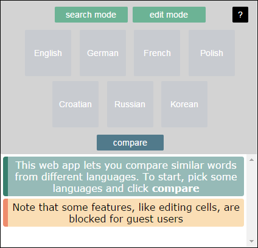

# languages

You can see the demo at:
[languages2.host-ed.me](https://www.languages2.host-ed.me)

## Stack

 - JavaScript with [jquery](jquery.com) and [https://github.com/asyncly/EventEmitter2](eventemitter2) libraries
 - PHP for backed (communicating with database and APIs)
 - MySQL database
